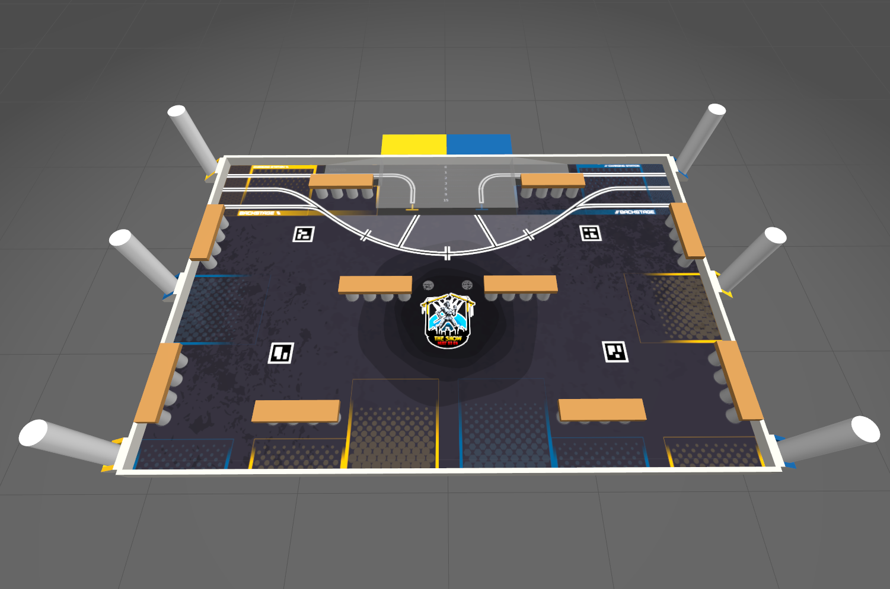

# Coupe de France de robotique

Ici se trouve le code source utilisé par le *Hermine Robotic Club* pour participer 
à la [coupe de France de robotique](https://www.coupederobotique.fr).

Le développement se fait en partenariat avec le 
[CRUBS](https://clubrobotiqueubs.wixsite.com/crubs).

## The show must go on

Édition 2025 de la coupe

    

    

## Résultats

| Année |        Thème        | Résultat |
|:------|:-------------------:|:--------:|
| 2025  | The show must go on |  Absent  |
